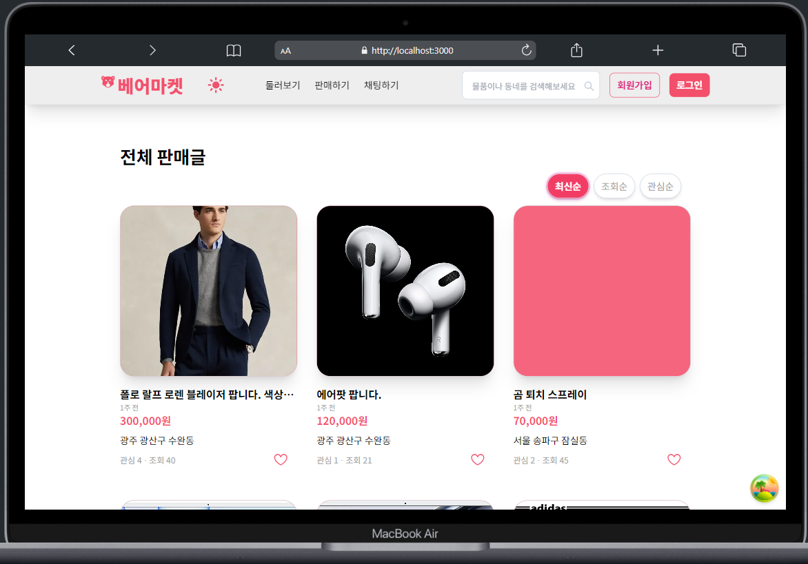
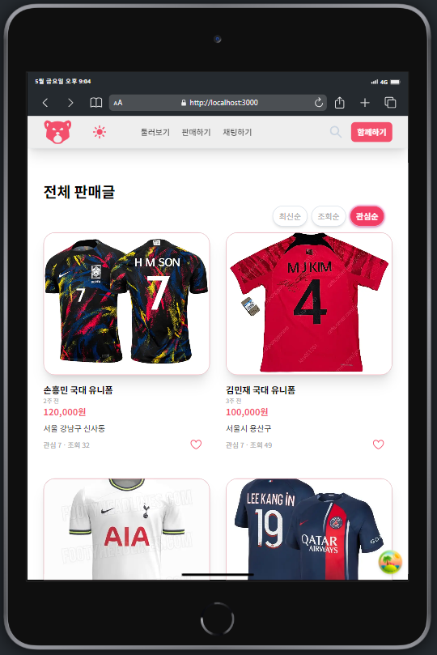
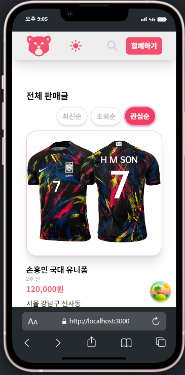
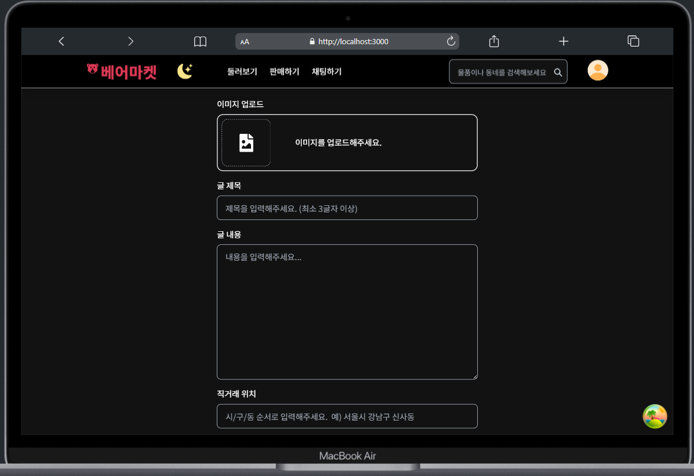
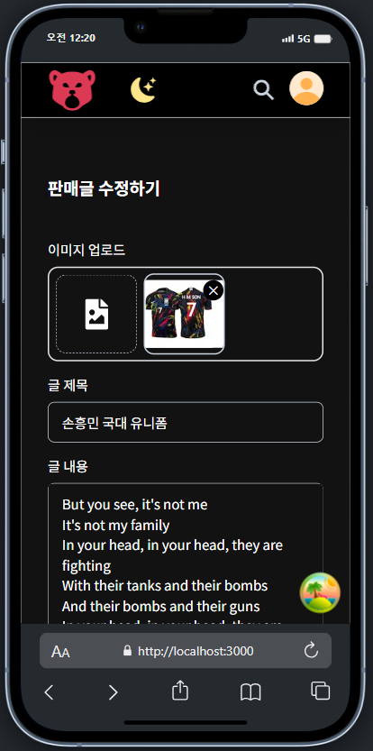
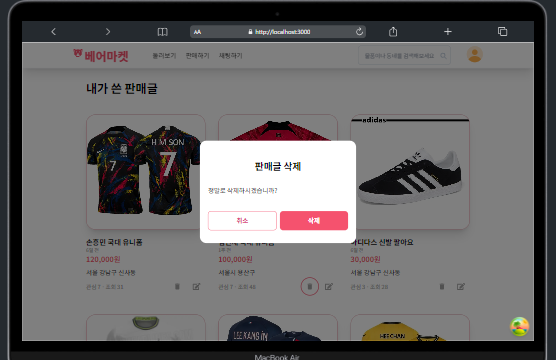
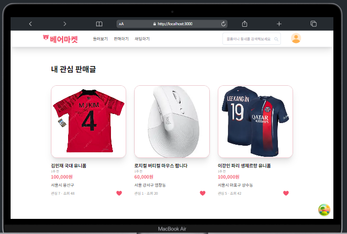

# 
[베어 마켓 🐻]

## 목차

[1. 프로젝트 소개]
[2. 기술 스택]
[3. 주안점]
[4. 구현 기능]
[5. 개발 과정]
[6. 회고]

 

## 1. 프로젝트 소개

베어마켓은 누구나 참여할 수 있는 중고거래 플랫폼으로,
유데미 X 사람인 풀스택 취업부트캠프에서 타임어택 과제로 진행한 **1인 풀스택 프로젝트**를 리팩토링 하였습니다.  
• 총 제작 기간: 2024.03.27 - 2024.03.29 (3 days)
• 보완 기간: 2024.04.01 ~ now (3 weeks)

> 🔗 [Server Repository](https://github.com/baeseongjae/time-attack-fullstack-server-refactor)

 

## 2. 사용 기술 스택

[Frontend]

- Framework - `Next.js (App Router)`
- Language - `Typescript`
- Style - `Tailwind CSS`
- Server State Library - `React Query`
- Client State Library - `ContextAPI`
- Deployment - `Vercel`

[Backend]

- Framework - `Nest.js`
- Language - `Typescript`
- ORM - `Prisma`
- Database - `PostgreSQL`
- Database Cloud - `AWS RDS`
- Deployment - `Cloudtype`

 

## 3. 주안점

① 기능 추가 (UX 관점)

- 타임어택 기간에 완성이 미흡했던 기능 보완
- 사용자 관점에서 필요한 기능
- 구현해보고 싶었던 기능
- 반응형 디자인 및 디테일 작업

② DX 관점에서 코드 및 폴더구조 리팩토링

- SRP 원칙을 고려한 컴포넌트 책임 분리
- 커스텀 훅 분리 (React-query, ContextAPI)
- API 호출 로직 분리
- 공통 컴포넌트는 bottom-up 방식으로 기존에 미리 구현.

③ Response 타입 체킹 및 에러메시지 관리

④ 성능 최적화

 

## 4. 구현 기능

### ✨ 반응형 디자인 (3단계)

|            메인 페이지\_데스크탑 (1280px ~)             |          메인 페이지\_태블릿(768px ~ 1080px)           |          메인 페이지\_모바일 (375px ~ 768px)           |
|:----------------------------------------------:|:----------------------------------------------:|:----------------------------------------------:|
|  |  |  |

- 판매글 최신순, 조회순, 관심순 정렬 기능
- 판매글 검색 기능
- tailwind config파일에서 breakpoint 커스터마이징하여 반응형 레이아웃 구성
  - Grid 셀
  - 로고
  - 메뉴바
  - 모달
  - 폰트 사이즈

 

### ✨ 회원인증 및 다크모드 상태

|                로그인 모달                |                메인페이지\_다크모드                |
|:------------------------------------:|:-----------------------------------------:|
|  |  |

- `context API`를 활용한 로그인 모달 구현
- 사용자 경험 향상을 위해 `react-toastify`를 활용한 alert 창 적용
- 로그아웃 상태에서 로그인이 필요한 서비스에 접근시 alert 창과 함께 로그인 모달 띄우기
- 비밀번호 숨김/보이기 토글 버튼 구현, tabindex를 -1 로 세팅하여 tab키로부터의 focus 접근을 방지하고 클릭으로만 접근할 수 있게 구현.
- input이 focus되거나 value값이 있을때, label이 좌측 상단으로 올라가는 floating label 구현
- 다크모드 토글버튼을 만들어, 필요시 테마변경 가능하도록 구현.

### ✨ 메인 페이지 (after 로그인)

|                메인 페이지                |                게시물 작성 페이지                 |
|:------------------------------------:|:-----------------------------------------:|
|  |  |

- 페이지 마운트시 관심버튼상태(하트) 서버상태 동기화
- react-query의 `useQuery`를 사용하여 유저 이메일 추출 후 해당 판매글의 작성자인지 판별
  - 작성자라면, 수정 및 삭제 버튼 및 기능 활성화
  - 타 유저 판매글이라면, 관심 및 관심취소 기능 활성화

 

### ✨ 판매글 생성/수정

|                판매글 생성 페이지                 |                판매글 수정 페이지                 |
|:-----------------------------------------:|:-----------------------------------------:|
|  |  |

[생성]
- `formData`를 활용하여, 이미지 포함한 판매글 정보 생성
- file 타입의 input요소 커스터마이징 - `useRef`를 활용해 커스텀 버튼 클릭 이벤트 발생시, hidden처리된 input요소가 활성화되도록 구현
- 작성 폼에서 이미지 업로드시, 해당 __이미지 미리보기__ 기능

[수정] 
- 수정 페이지 진입시 이미지를 포함한 이전 상태값들 서버로부터 불러와 렌더링.
- 해당 유저가 판매글 작성자일 경우에만, 수정 가능하도록 구현.

 

### ✨ 내가 쓴 판매글 페이지 / 내 관심 목록 페이지

|                   내가 쓴 판매글 페이지                    |                  내 관심 목록 페이지                  |
|:-------------------------------------------------:|:---------------------------------------------:|
|  |  |

[내가 쓴 판매글 페이지]
- `use client`로 클라이언트 컴포넌트로 만들어, `useQuery` 활용하여 내가 작성한 판매글 데이터 불러오도록 구현.

[내 관심목록 페이지]
- `useQuery`의 `enabled`속성 활용하여 로그인 상태일 경우에만, interest 데이터를 받아오도록 구현하였고, 해당 interest의 dealId를 기반으로, 관심 판매글 데이터 정보를 가져오도록 구현.

 

## 5. 개발 과정
