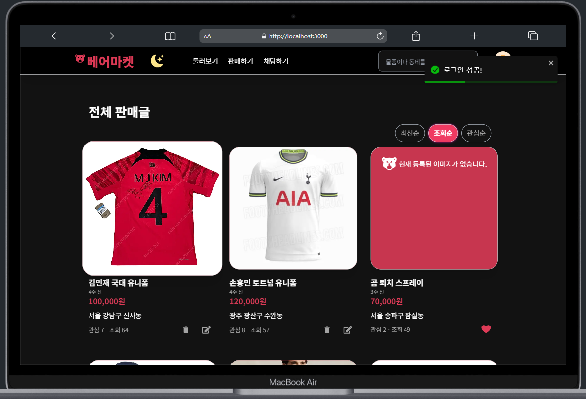

# 
[베어 마켓 🐻]

## 목차

[1. 프로젝트 소개](#1-프로젝트-소개) 
[2. 기술 스택](#2-기술-스택) 
[3. 주안점](#3-주안점) 
[4. 구현 기능](#4-구현-기능) 
[5. 개발 과정](#5-개발-과정) 
[6. 회고](#6-회고)

 

## 1. 프로젝트 소개

베어마켓은 누구나 참여할 수 있는 중고거래 플랫폼으로,
유데미 X 사람인 풀스택 취업부트캠프에서 진행한 **1인 풀스택 프로젝트**를 리팩토링 하였습니다.  
• 총 제작 기간: 2024.03.27 - 2024.03.29 (3 days) 
• 보완 기간: 2024.04.01 ~ now (3 weeks)

> 🔗 [Server Repository](https://github.com/baeseongjae/time-attack-fullstack-server-refactor)
>
> 🔗 [application](https://time-attack-fullstack-client-refactor.vercel.app)

 

## 2. 기술 스택

**Frontend Stack**

- Framework - `Next.js (App Router)`
- Language - `Typescript`
- Style - `Tailwind CSS`
- Server State Library - `React Query`
- Client State Library - `ContextAPI`
- Deployment - `Vercel`

**Backend Stack**

- Framework - `Nest.js`
- Language - `Typescript`
- ORM - `Prisma`
- Database - `PostgreSQL`
- Database Cloud - `AWS RDS`
- Deployment - `Cloudtype`

 

## 3. 주안점

**① 기능 추가 (UX 관점)**

- 완성이 미흡했던 기능 보완
- UX 관점에서 필요한 기능 추가
- 반응형 디자인 UI 및 기능 디테일 작업

**② DX 관점에서 코드 및 폴더구조 리팩토링**

- SRP 원칙을 고려한 컴포넌트 책임 분리
- 커스텀 훅 분리 (React-query, ContextAPI)
- API 통신 로직 분리

**③ 타입스크립트 확인 Response 타입 체킹 및 에러메시지 관리**
- API response에 Typescript의 제네릭을 활용한 강력한 타입 정의
  - 컴파일 시점에서 오류를 사전에 감지하여, 런타임 오류를 사전에 줄임
  - 여러 response에 재사용하여 코드 일관성 유지가 가능.
  
**④ 성능 최적화**
- NextJS를 활용한 SSR + CSR 혼용한 방식으로 초기 페이지 로드 시간 단축
  - 동적 콘텐츠와 정적 콘텐츠의 적절한 관리가 가능.
  - SEO 성능 향상
- React Query의 캐싱 기능을 활용한 네트워크 요청 최소화

 

## 4. 구현 기능

### ✨ 반응형 디자인 (3단계)

|                   메인 페이지\_데스크탑 (1280px ~)                   |                메인 페이지\_태블릿(768px ~ 1080px)                 |                메인 페이지\_모바일 (375px ~ 768px)                 |
|:-----------------------------------------------------------:|:----------------------------------------------------------:|:----------------------------------------------------------:|
|  |  |  |

- 판매글 최신순, 조회순, 관심순 정렬 기능
- 판매글 검색 기능
- tailwind config파일에서 breakpoint 커스터마이징하여 반응형 레이아웃 구성
  - Grid 셀
  - 로고
  - 메뉴바
  - 모달
  - 폰트 사이즈

 

### ✨ 회원인증 및 다크모드 상태

|                       로그인 모달                       |                           메인페이지\_다크모드                            |
|:--------------------------------------------------:|:----------------------------------------------------------------:|
|  |  |

[로그인 모달]
- 로그아웃 상태에서 로그인이 필요한 서비스에 접근시 alert 창과 함께 로그인 모달 띄우기
- `context API`를 활용한 로그인 모달 구현
- input이 focus되거나 value값이 있을때, label이 좌측 상단으로 올라가는 floating label 구현
- 사용자 경험 향상을 위해 `react-toastify`를 활용한 alert 창 적용
- 비밀번호 숨김/보이기 토글 버튼 구현, tabindex를 -1 로 세팅하여 tab키로부터의 focus 접근을 방지하고 클릭으로만 접근할 수 있게 구현.

[회원인증]
- 회원인증에 성공 후 인증기능이 필요한 추가적인 API 요청 시, Request의 header에 `bearer` 형식으로 백엔드로부터 받은 accessToken을 추가하여 전송.
- `context API`를 활용한 로그인 상태 관리
- 로컬 스토리지를 활용한 accessToken 저장 및 새로고침 시 로그인 유지 (=> 서버사이드 이슈로 추후 작업 예정 혹은 쿠키방식으로 변경 예정)

[다크모드]
- 다크모드 토글버튼을 만들어, 필요시 테마변경 가능하도록 구현.

### ✨ 메인 페이지 (after 로그인) 및 상세 페이지

|                                        메인 페이지(after 로그인)                                        |                                     판매글 상세 페이지                                      |
|:-----------------------------------------------------------------------------------------------:|:-----------------------------------------------------------------------------------:|
|  |  |

[메인 페이지]
- 페이지 마운트시 관심버튼 토글상태(하트) 서버상태 동기화
  - `useQuery`활용하여 백엔드 통신 및 `useEffect`활용하여 지역상태 세팅
- react-query의 `useQuery`를 사용하여 유저 이메일 추출 후 해당 판매글의 작성자인지 판별
  - 작성자라면, 수정 및 삭제 버튼 및 기능 활성화
  - 타 유저 판매글이라면, 관심 및 관심취소 기능 활성화
  - `enabled` 속성 추가하여, 로그인 상태가 true일 경우에만 쿼리 실행 (불필요한 요청 방지)
- 헤더에 프로필 아이콘 추가
  - 클릭시 드롭다운 활성화 (판매하기, 내판매글, 내 관심글, 로그아웃 등등)
- 로그아웃 시 쿼리 캐시 초기화

[판매글 상세 페이지]
- 로그인 상태에 따른 조건부 렌더링 위와 동일.
- 관심목록 아래단에 인기순(조회+관심)으로 sort 처리된 인기 판매글 정보 렌더링. 

 

### ✨ 판매글 생성/수정

|                                     판매글 생성 페이지                                      |                                     판매글 수정 페이지                                      |
|:-----------------------------------------------------------------------------------:|:-----------------------------------------------------------------------------------:|
|  |  |

[생성]
- `formData`를 활용하여, 이미지 포함한 판매글 정보 생성
- file 타입의 input요소 커스터마이징 - `useRef`를 활용해 커스텀 버튼 클릭 이벤트 발생시, hidden처리된 input요소가 활성화되도록 구현
- 작성 폼에서 이미지 업로드시, 해당 __이미지 미리보기__ 기능

[수정] 
- 수정 페이지 진입시 이미지를 포함한 이전 상태값들 서버로부터 불러와 렌더링.
- 해당 유저가 판매글 작성자일 경우에만, 수정 가능하도록 구현.

 

### ✨ 내가 쓴 판매글 페이지 / 내 관심 목록 페이지

|                                         내가 쓴 판매글 페이지                                          |                                       내 관심 목록 페이지                                        |
|:---------------------------------------------------------------------------------------------:|:----------------------------------------------------------------------------------------:|
|  |  |

[내가 쓴 판매글 페이지]
- 해당 페이지 CSR로 렌더링, `useQuery`, `axios`활용한 HTTP GET 요청을 통해 내가 작성한 판매글 데이터 API로부터 받도록 구현.
- 판매글 수정, 삭제 가능

[내 관심목록 페이지]
- `useQuery`의 `enabled`속성 활용하여 로그인 상태일 경우에만 interest 데이터를 받아오도록 구현하였고, 해당 interest의 dealId를 기반으로 관심 판매글 데이터 정보를 가져오도록 구현.
- 관심버튼 토글버튼 클릭시, 서버상태 동기화 및 클라이언트에서 즉시 제거되도록 구현.
- 관심목록 아래단에 인기순(조회+관심)으로 sort 처리된 인기 판매글 정보 렌더링.

 

## 5. 개발 과정

### src 디렉토리 구조

| 폴더명         | 설명                                                                                                     |
|-------------|--------------------------------------------------------------------------------------------------------|
| api         | 백엔드 api 통신 요청하는 로직 관리하는 폴더                                                                             |
| app         | NextJS의 app router사용 폴더 (app router는 폴더 기반 라우팅을 통해 각 디렉토리가 고유한 URL 경로를 형성하고 페이지, 레이아웃 등을 통해 UI구조를 제공.) |
| components  | 공통 컴포넌트 담긴 폴더                                                                                          |
| contexts    | Context API를 활용해 전역상태 제공하는 컨텍스트를 관리                                                                    |
| hooks       | 그 외의 커스텀 훅을 관리                                                                                         |
| react-query | React Query의 여러 함수들을 커스터마이징한 커스텀 훅 관리                                                                  |
| themes      | 다크모드 와같은 테마 설정 담긴 폴더                                                                                   |
| types       | 프로젝트에서 사용되는 데이터들의 타입 정의                                                                                |
| utils       | 재사용 목적의 유틸리티 함수 관리하는 폴더                                                                                |
  
